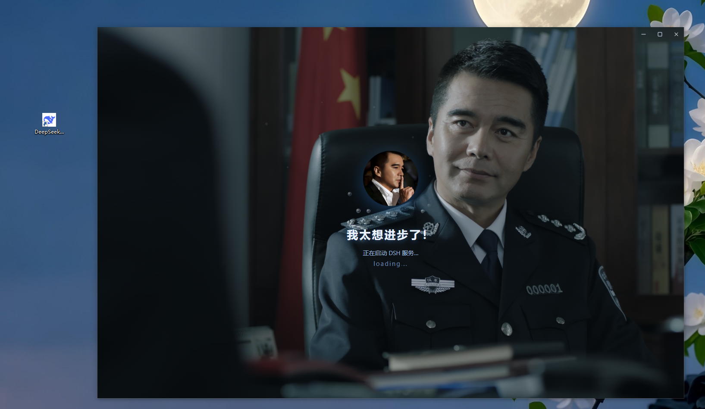
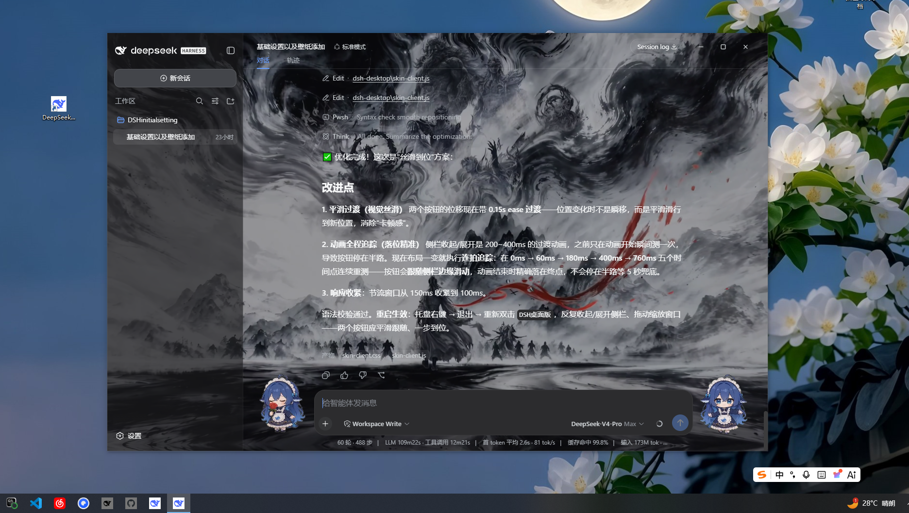
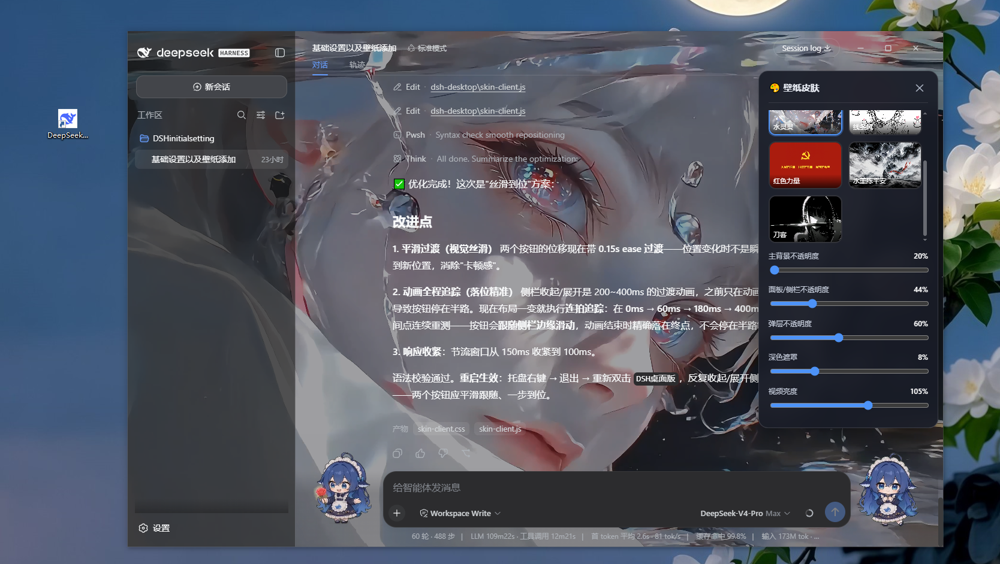
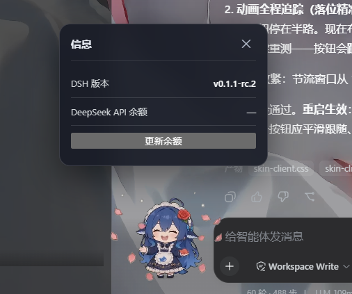

# DSH 桌面版（dsh-desktop）

> 一键安装，基于官方 dsh-web 端的桌面端（Electron）开发，涵壁纸以及鲸鱼娘挂件，与原 web 端的对话内容完全同步，实时启动最新版的 dsh，可修改与优化以及添加壁纸！

把官方 **DeepSeek Harness（DSH）Web 界面**装进一个美观的 Windows 桌面应用：
启动加载动画、无边框一体外观、动态壁纸切换器、鲸鱼娘挂件、信息面板、托盘常驻。
**不修改官方代码**——官方 DSH 每次启动由 `npx` 自动拉取最新版，会话数据与网页端完全同步。

## 📸 界面预览

| 启动界面 | 主界面 |
|----------|--------|
|  |  |

| 皮肤切换控制面板 | 鲸鱼娘小挂件 |
|------------------|--------------|
|  |  |

## ✨ 特性

- **一键安装**：双击 `一键安装.bat` 自动下载 Electron 运行时并创建桌面快捷方式（已装过则自动跳过下载）；
- **启动加载动画**：自定义加载页（背景/头像/标题可替换）；
- **无边框一体外观**：无白色标题栏，壁纸铺满窗口；窗口控制按钮嵌在界面头部「Session log」右侧；头部空白区可拖动窗口；
- **动态壁纸切换器**：右下角鲸鱼娘挂件按钮打开面板，多张动态/静态壁纸封面点击**无缝切换**；主背景/面板侧栏/弹层不透明度、深色遮罩、视频亮度五个参数**每张壁纸独立记忆**、重启持久；
- **信息面板**：侧栏与输入框之间的挂件按钮，显示 DSH 版本号（自动）+ DeepSeek API 余额（手动更新）；
- **托盘常驻**：关闭窗口 = 隐藏到托盘，服务继续后台运行；
- **官方体验**：后台隐藏 cmd 自动执行 `npx --yes @deepseek-ai/dsh web --no-open`，实时使用官方最新版，会话与网页端完全同步；
- **首次使用引导**：输入一次 DeepSeek API Key 即可（保存在本机，与官方共用）。

## 📖 使用教程（详细步骤）

**前提**：Windows 10/11；已安装 [Node.js](https://nodejs.org/zh-cn)（LTS 18+，安装时保持默认选项即可）；能联网。

**第一步：获取本应用**
- 从本仓库 **Releases** 下载 `DSH桌面版-源码包.zip` 解压到任意目录（路径勿含中文）；
- 或点击仓库 **Code → Download ZIP**（此方式不含壁纸素材，功能不受影响）。

**第二步：一键安装**
双击解压目录里的 **`一键安装.bat`**：
- 自动执行 `npm install` 下载 Electron 运行时（约 110MB，仅一次；国内自动走 npmmirror 镜像加速）；
- 自动在桌面创建「DSH桌面版」快捷方式；
- 若之前已安装过（检测到 Electron），会**跳过下载**直接创建快捷方式。

**第三步：启动与首次配置**
1. 双击桌面 **「DSH桌面版」**；
2. 首次启动输入你的 DeepSeek API Key（可在 platform.deepseek.com 获取；保存在本机 `~/.dsh`，与官方 DSH 共用）；
3. 等待加载动画完成（首次自动下载官方最新版 DSH，可能需要几分钟）→ 进入主界面。

**第四步：日常使用**
- 双击桌面图标即用；关闭窗口进托盘，右键托盘可退出；
- 点右下角鲸鱼娘 → 切换壁纸、调节五个参数（每张壁纸独立记忆）；
- 点侧栏旁的挂件 → 查看 DSH 版本与 API 余额（手动更新）。

## 🔍 开发原理（通俗版）

**它是什么？** 一个"壳 + 官方内核"的桌面应用：壳是我们写的 Electron 桌面窗口，内核是官方 DSH Web 服务。

**怎么工作的？**
1. 双击启动后，桌面端在**后台悄悄执行** `npx @deepseek-ai/dsh web`（黑色 cmd 窗口被隐藏），这就是你平时手动启动网页版的那条命令；
2. 官方服务在 `127.0.0.1:3080` 跑起来后，我们的窗口加载的**就是官方网页**（一个字没改）；
3. 壁纸、挂件、无边框等美化效果，是窗口加载完成后**在页面上叠加注入**的样式与组件，官方升级时自动兼容。

**为什么与原网页端完全同步？** 因为内核就是官方 DSH，会话记录存在同一个 `~/.dsh` 目录——你在网页版聊的内容，打开桌面端全都在。

**为什么实时最新版？** 每次启动 `npx` 都会检查官方最新版本：缓存里有就直接用（秒开），官方发了新版就静默下载一次，之后继续秒开。

**为什么要装 Node.js？** 两个原因：①Electron 窗口引擎基于 Node 运行；②要用系统里的 `npx` 来拉起官方 DSH。装一次即可。

**为什么加壁纸这么简单？** 壁纸只是 `assets/wallpapers/` 里的普通视频/图片文件，程序启动时读取它们。

## 🛠 自定义与二次开发

```powershell
npm start            # 启动（等价于双击快捷方式）
node --check main.js # 语法检查
```

- **添加壁纸**：把视频/图片放入 `assets/wallpapers/`，在 `main.js` 顶部 `WALLPAPERS` 数组按格式加一行（`id` 用英文、`name` 为显示名、`file` 指向文件），重启即出现在切换面板；
- **换加载页**：替换 `assets/background.png`、`assets/avatar.png`，或编辑 `loading.html` 的文字与样式；
- **换挂件动图**：替换 `assets/fab.webm`（鲸鱼娘）、`assets/info-fab.webm`（信息挂件）；
- **改默认参数**：`main.js` 顶部 `SKIN_PROFILE_DEFAULTS` 可调整默认透明度等。

## 📁 目录结构

```
dsh-desktop/
├── main.js             # 主进程：启动官方服务、无边框窗口、托盘、wallpaper:// 协议、IPC
├── preload.js          # 安全 IPC 桥（白名单通道）
├── loading.html        # 启动加载页
├── first-run.html      # 首次使用 API Key 设置页
├── skin-client.js      # 注入主界面的引擎（壁纸层、切换器、窗口按钮、信息面板）
├── skin-client.css     # 注入样式
├── 一键安装.bat         # 一键安装（npm install + 桌面快捷方式）
├── 发布到GitHub.bat     # 发布/更新本仓库（需 GitHub CLI）
├── docs/screenshots/   # 界面截图
└── assets/             # 壁纸、挂件动图、应用图标、加载页素材
```

## ❓ 常见问题

- **启动报"未找到 npm"**：先安装 Node.js；
- **余额显示"查询失败"**：悬停查看原因，多为网络问题或 Key 无效；
- **想卸载**：删除桌面快捷方式与本目录即可（会话数据保留在 `~/.dsh`，删除该目录会清除所有 DSH 使用记录，请谨慎）。

## 📄 许可

MIT License。本项目不包含 DeepSeek Harness 代码（官方 DSH 由其官方 npm 包动态提供）；`assets/` 内壁纸与动图素材版权归原作者，仅供个人使用，请勿用于商业分发。
